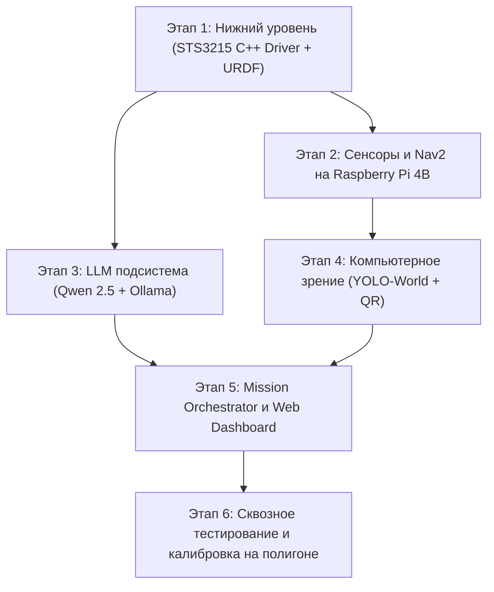

# Поэтапный план реализации проекта IJKbot

Данный документ представляет собой пошаговый план разработки программно-аппаратного комплекса мобильного робота **IJKbot** для участия в хакатоне «Эвакуация» (соревнования «Кубок РТК Высшая Лига», Ижевск).

---

## Граф зависимостей этапов

---

## Этап 1: Нижний уровень управления и одометрия (Raspberry Pi 4B)

**Цель**: Реализовать надежный C++ драйвер приводов Feetech STS3215, расчет одометрии и описание кинематики робота в формате URDF/Xacro.

### Текущее продвижение (19.09.2026)
- Реализован `diff_drive_node`: два привода (левый ID 1, правый ID 2), Sync Write/Read,
  проверка ответов UART и таймаутов, `/cmd_vel`, `/odom`, `odom -> base_footprint`,
  цикл 50 Гц, YAML-параметры, launch, диагностика и mock-режим по умолчанию.
- После 200 мс без команды начинается плавное торможение. Это программный watchdog;
  независимая аппаратная защита при зависании Pi пока не реализована.
- Геометрия уточнена по измерениям: диаметр 75 мм, колея по центрам 225 мм,
  расстояние передняя/задняя ось 140 мм, ширина ведущей шины 25 мм.
- Добавлены проверки кинематики, UART через псевдотерминал и ROS-интеграции в mock.
  Сборка успешна; 19 автоматических тестов пройдены.
- Первичная проверка физических приводов на вывешенных колёсах: ID 1/2 отвечают
  на `/dev/ttyACM1`, оба переведены в wheel mode. Sync Read: 50 циклов без ошибок,
  максимум 1.27 мс при повторном чтении. Выполнены отдельные команды колёсам
  по 0.02 м/с на 1 с; оба дали ожидаемый отклик энкодеров.
  Проверка остановки правого колеса по мгновенной оценке скорости не прошла:
  остаточное вращение и шум энкодера пока не разграничены. После завершения
  чтением подтверждены `goal_speed=0`, `speed=0`, `torque=0` у обоих приводов.
  Оператор сообщил, что оба колеса вращались назад. Знаки команд и энкодеров
  исправлены с `+1/-1` на `-1/+1`; повторная проверка направления ещё не выполнена.
- Приемка на физических приводах, калибровка направлений и пакет `ijkbot_description`
  остаются следующими задачами. Полное TF-дерево пока отсутствует.

### Задачи:
1. **Разработка пакета `sts3215_driver` (C++ / ROS 2 Jazzy)**:
   - Создать модуль работы с UART (`serial.c` / `serial.h`) с поддержкой скорости 1 000 000 бод и работы через переходник Waveshare USB-UART (`/dev/ttyUSB0`).
   - Реализовать протокол Feetech STS3215 (`sts3215.c` / `sts3215.h`): инициализация в режим Wheel Mode (Continuous Rotation), Sync Write для синхронной отправки скоростей, Sync Read для чтения позиций энкодеров, скоростей, напряжения и температуры.
   - Разработать ноду `diff_drive_node`:
     - Подписка на `/cmd_vel` (`geometry_msgs/msg/Twist`).
     - Пересчет скоростей по дифференциальной кинематике ($D = 75\text{ мм}$, $L = 225\text{ мм}$ — колея по центрам ведущих шин).
     - Расчет одометрии по энкодерам на частоте 50 Гц.
     - Публикация `/odom` (`nav_msgs/msg/Odometry`) и широковещание `tf` `odom -> base_footprint`.
     - Реализация Watchdog: автоматическая плавная остановка моторов при отсутствии команд `/cmd_vel` более 200 мс.
   - Вынести все физические константы в `config/params.yaml`.

2. **Разработка пакета `ijkbot_description`**:
   - Создать `urdf/ijkbot.urdf.xacro`:
     - Звенья: `base_footprint`, `base_link`, передние ведущие колеса (`wheel_left_link`, `wheel_right_link`), задние пассивные кастеры (`caster_left_link`, `caster_right_link`), стойка и корпус камеры `camera_link`.
     - Настроить точные геометрические габариты и смещения.
   - Создать `launch/rsp.launch.py` (запуск `robot_state_publisher`).

### Критерии приемки:
- [ ] При публикации в `/cmd_vel` робот движется вперед/назад и вращается с заданной линейной и угловой скоростью.
- [ ] Топик `/odom` публикует корректные координаты и линейную/угловую скорость.
- [ ] Дерево TF `odom -> base_footprint -> base_link -> camera_link` валидно и не имеет разрывов (`ros2 run tf2_tools view_frames`).
- [ ] При прерывании `/cmd_vel` более чем на 200 мс начинается плавная остановка (с учетом периода цикла и UART). Дополнительное время торможения определяется текущей скоростью и `watchdog_deceleration`; фактический тормозной путь проверяется на роботе.
- [ ] При неисправности UART предпринимается аварийная остановка, дальнейшие команды блокируются до перезапуска. При физическом обрыве UART доставка остановки не гарантируется; необходима независимая аппаратная защита.

---

## Этап 2: Сенсорный пайплайн и навигация Nav2 (Raspberry Pi 4B)

**Цель**: Настроить получение 2D лазерскана из глубины RealSense D435 и сконфигурировать стек Nav2 с повышенным приоритетом предотвращения столкновений (-70 баллов за касание).

### Задачи:
1. **Интеграция сенсоров**:
   - Настроить запуск драйвера `realsense2_camera` в энергоэффективном режиме для Pi 4B (RGB 640×480 @ 15/30 FPS, Aligned Depth 640×480 @ 15/30 FPS).
   - Настроить `depthimage_to_laserscan`: срез глубины по высоте (на уровне 5–20 см от пола) $\to$ формирование топика `/scan` (`sensor_msgs/msg/LaserScan`).
   - Настроить сжатие RGB-потока через `image_transport` (`compressed` JPEG) для передачи на ноутбук.

2. **Разработка пакета `ijkbot_nav2`**:
   - Сформировать `config/nav2_params.yaml`:
     - **Local Costmap**: обновление от локального `/scan` на частоте 10–15 Гц, `inflation_radius` с защитным буфером не менее 50–70 мм от габаритов робота.
     - **Global Costmap**: статическая карта полигона (периметр 4×4 м) + слой препятствий (`obstacle_layer` от `/scan`).
     - **Контроллер**: `nav2_regulated_pure_pursuit_controller` (плавное следование по траектории, замедление перед препятствиями, ограничение $V_{max} \le 0.25\text{ м/с}$).
     - **Планировщик**: `NavFn` или `SmacPlanner2D`.
     - **Recovery Behaviors**: безопасные маневры восстановления (вращение на месте, откат назад с проверкой препятствий).
   - Подготовить статическую сетку полигона `maps/polygon_empty_4x4.yaml` (стены периметра 4×4 м).
   - Создать `launch/navigation.launch.py`.

### Критерии приемки:
- [ ] Нода `depthimage_to_laserscan` стабильно публикует `/scan` при загрузке CPU Pi 4B не более 15%.
- [ ] Nav2 успешно строит локальный и глобальный costmap, динамические препятствия (коробки, макеты) корректно раздуваются в costmap.
- [ ] Робот автономно перемещается по целевым точкам (`NavigateToPose`), огибает препятствия без касаний.

---

## Этап 3: LLM подсистема и Mission Orchestrator (Ноутбук)

**Цель**: Обеспечить автономную интерпретацию текстового задания судей в структурированную команду для робота (+100 баллов) с использованием локальной LLM Qwen 2.5 7B.

### Текущее продвижение (19.09.2026):
- Развернута локальная Ollama с моделью `qwen2.5:7b` (Q4_K_M) на RTX 5060 Laptop GPU (потребление VRAM ~4.6 ГБ из 8 ГБ).
- Разработан пакет ROS 2 Jazzy `ijkbot_brain`: `package.xml`, `setup.py`, `setup.cfg`, `resource/ijkbot_brain`.
- Реализован `ijkbot_brain/llm_client.py`:
  - `LandmarkID` (7 регламентных ориентиров: `smoke_tower`, `panel_house`, `bridges`, `tanker_truck`, `fallen_tree`, `car_jam`, `debris_pvc`).
  - Строгий режим `format: OLLAMA_JSON_SCHEMA` (гарантирует валидный JSON без галлюцинаций сторонних сущностей).
  - Структура `CommandInterpretation` с полями `target_landmark_id`, `search_strategy`, `reasoning`, `confidence`, `latency_sec`.
  - Двухуровневая защита: при сетевых задержках или сбоях Ollama автоматически включается детерминированный семантический fallback-парсер.
  - Поддержка ROS 2 ноды (топики `/mission/judge_task` -> `/mission/target_command`) и CLI-режима.
  - Метод `warmup()` с `keep_alive: -1` для удержания модели в GPU и быстрого отклика.
- Разработан тестовый набор `ijkbot_brain/test_llm.py` из 14 тестов (100% пройдено).
- Пакет успешно собран через `colcon build --symlink-install --packages-select ijkbot_brain`. Подробный отчет см. в [step3.md](file:///home/xaten/IJKbot/step3.md).

### Задачи:
1. **Развертывание LLM на ноутбуке с RTX 5060**:
   - [x] Установка и настройка Ollama с моделью `qwen2.5:7b-instruct-q4_K_M`.
   - [x] Проверка потребления видеопамяти (должно укладываться в ~4.5–5.0 ГБ из доступных 8 ГБ) — факт: 4.6 ГБ.

2. **Разработка пакета `ijkbot_brain`**:
   - [x] `ijkbot_brain/llm_client.py`:
     - [x] Формирование системного промпта с жестко заданной JSON-схемой и списком допустимых ориентиров полигона (`smoke_tower`, `panel_house`, `bridges`, `tanker_truck`, `fallen_tree`, `car_jam`, `debris_pvc`).
     - [x] Запрос к Ollama API в режиме Structured Outputs (`format: schema`).
     - [x] Парсинг и валидация ответа: извлечение ID ориентира, стратегии поиска и текстового обоснования для судей.
     - [x] Детерминированный fallback-парсер на случай таймаута или сбоя LLM.
   - [x] Тестовый скрипт с набором типовых судейских формулировок на русском языке для валидации 100% точности распознавания (`ijkbot_brain/test_llm.py`).

### Критерии приемки:
- [x] Время обработки текста задания моделью составляет менее 2–3 секунд на RTX 5060 при работе от батареи (при warm call).
- [x] Любое валидное описание объекта из регламента однозначно мапится в правильный `target_landmark_id`.
- [x] Ответ всегда возвращается в строгом JSON-формате без лишнего текста.

---

## Этап 4: Компьютерное зрение и чтение QR-кодов (Ноутбук)

**Цель**: Реализовать обнаружение ориентиров, пострадавшего человека и считывание QR-кода о его состоянии (+160 + 80 баллов).

### Задачи:
1. **Разработка пакета `ijkbot_vision`**:
   - `ijkbot_vision/yolo_world_node.py`:
     - Подписка на сжатый видеопоток `/camera/color/image_raw/compressed`.
     - Запуск инференса YOLO-World (Open-Vocabulary) на RTX 5060 по классам ориентиров и человека (`mannequin`, `injured person`, `lying human`).
     - Публикация результатов детекций в кастомный топик или топик визирования.
   - `ijkbot_vision/deprojector.py`:
     - Сопоставление bounding box с картой глубины RealSense.
     - Определение 3D координат центра объекта в системе `camera_color_optical_frame` и перевод через TF в глобальную систему `map`.
   - `ijkbot_vision/qr_reader_node.py`:
     - Распознавание QR-кодов с помощью `pyzbar` / `cv2.wechat_qrcode`.
     - Извлечение текста о состоянии пострадавшего и публикация в `/victim_status`.

### Критерии приемки:
- [ ] Детектор ориентиров и человека работает с частотой не менее 20 FPS на RTX 5060.
- [ ] Координаты обнаруженного объекта в системе `map` рассчитываются с погрешностью не более 10 см.
- [ ] QR-код стабильно распознается с расстояния 0.3–0.8 м при наведении камеры.

---

## Этап 5: Конечный автомат миссии и Web Dashboard (Ноутбук)

**Цель**: Объединить все подсистемы в единый управляемый процесс с удобным судейским интерфейсом на NiceGUI.

### Задачи:
1. **Mission State Machine (`ijkbot_brain/mission_sm.py`)**:
   - Реализовать состояния:
     - `PREPARATION`: Ожидание ввода задания от судей.
     - `LLM_PARSING`: Преобразование текста в JSON команду (+100 баллов).
     - `READY_TO_START`: Ожидание сигнала старта.
     - `NAVIGATING_TO_LANDMARK`: Движение Nav2 к точке обзора заданного ориентира.
     - `SEARCHING_VICTIM`: Локальный осмотр смежных ячеек, поиск человека камерой.
     - `APPROACHING_VICTIM`: Подъезд в ближайшую ячейку к пострадавшему (+160 баллов).
     - `WAIT_5_SECONDS`: Остановка и удержание робота в ячейке не менее 5 секунд (по регламенту).
     - `READING_QR`: Считывание QR-кода состояния (+80 баллов).
     - `RETURNING_HOME`: Навигация в стартовую ячейку [0, 0] (+160 баллов).
     - `MISSION_COMPLETE`: Завершение попытки, фиксация общего времени и логов.

2. **Разработка Web Dashboard (`ijkbot_brain/dashboard_app.py`)**:
   - Создание интерфейса на NiceGUI:
     - Окно ввода задания судьи и демонстрации работы LLM с подсветкой JSON.
     - Видеопоток с камеры с наложенными детекциями и рамкой QR-кода.
     - Интерактивная карта полигона с положением робота и ячеек 5×5.
     - Кнопки: «Распознать задание», «СТАРТ МИССИИ», «E-STOP».
     - Лог-панель с временными метками для демонстрации судьям.

### Критерии приемки:
- [ ] Панель открывается в браузере ноутбука без задержек.
- [ ] Полный цикл миссии (от ввода текста до возврата на старт) выполняется по нажатию кнопки «СТАРТ» без ручного вмешательства.
- [ ] Лог каждого действия фиксируется с точностью до миллисекунд.

---

## Этап 6: Сквозное тестирование и калибровка на полигоне

**Цель**: Провести полевые испытания на реальном полигоне, откалибровать параметры и защитить регламентные требования.

### Задачи:
1. **Калибровка одометрии и габаритов**:
   - Заезд по прямой на 2 метра: подгонка эффективного диаметра колес.
   - Вращение на 360° на месте: подгонка эффективной колесной базы $L$.
2. **Настройка высоты и углов обзора RealSense**:
   - Проверка видимости низких препятствий (модели машинок, упавшее дерево) и QR-кодов на манекене.
3. **Тренировочные заезды по регламенту**:
   - Прогон с ограничением времени: 5 минут подготовка + 5 минут миссия.
   - Проверка поведения при обходе мостов и завалов.
   - Фиксация результатов попыток и устранение краевых случаев.

### Критерии приемки:
- [ ] Робот успешно выполняет миссию в пределах 5 минут регламентного времени.
- [ ] 0 столкновений с объектами полигона за 3 контрольных прогона подряд.
- [ ] Судейские логи наглядно демонстрируют выполнение каждого пункта регламента на максимальный балл (500 баллов).
