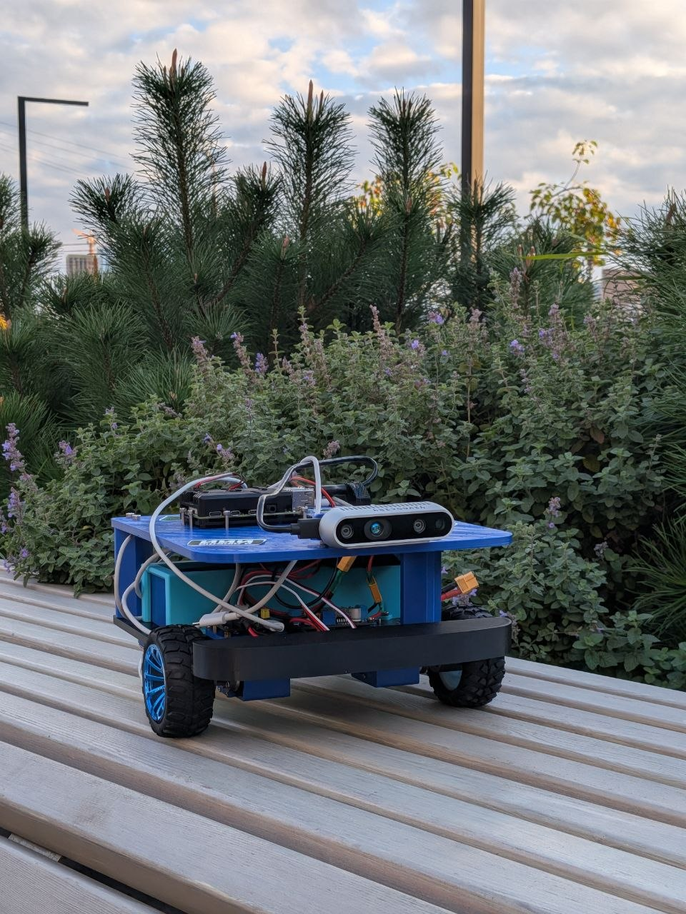
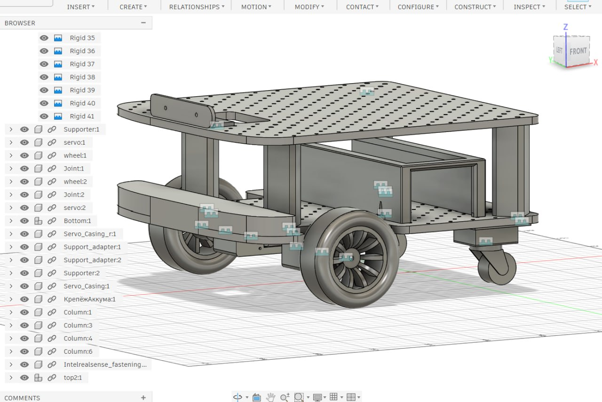
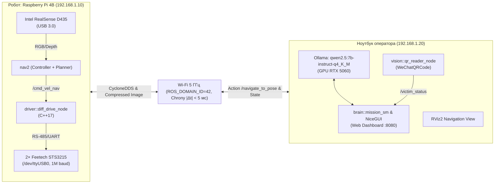
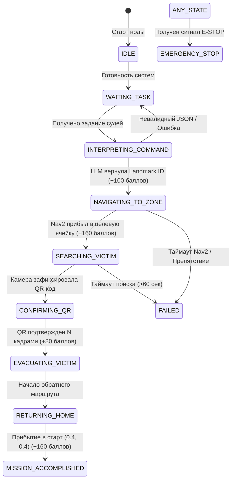
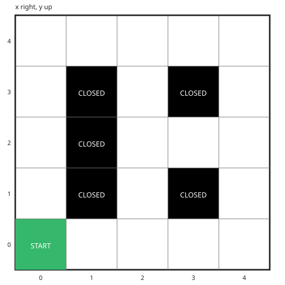

# IJKbot — Двуколесная мобильная платформа автономной эвакуации

[](https://docs.ros.org/en/jazzy/)
[](https://www.raspberrypi.com/products/raspberry-pi-4-model-b/)
[]()
[](LICENSE)

<p align="center">
  
</p>

**IJKbot** — мобильный робот дифференциального привода, созданный для участия в хакатоне «Эвакуация» (соревнования **«Кубок РТК Высшая Лига»**, г. Ижевск). Робот выполняет автономную навигацию по семантической карте полигона, распознает голосовые и текстовые команды судей через локальную LLM, обнаруживает пострадавшего, считывает медицинские данные с QR-кода и осуществляет эвакуацию в стартовую ячейку.

---

## 1. Регламент и система начисления баллов

В соревновательном регламенте хакатона ключевую роль играет безошибочность и скорость автономного цикла (5 минут на ввод задания и работу LLM, 5 минут на выполнение заезда):

| Критерий регламента | Баллы | Критичность и правила |
|---|:---:|---|
| **Корректная интерпретация команды языковой моделью (LLM)** | `+100` | Строгий structured JSON-ответ с привязкой к ячейке арены |
| **Обнаружение пострадавшего человека на полигоне** | `+160` | Заезд в целевую зону ориентира и визуальная фиксация |
| **Считывание состояния пострадавшего с QR-кода** | `+80` | Многокадровое подтверждение через WeChatQRCode |
| **Эвакуация пострадавшего в пункт сбора (старт)** | `+160` | Возврат в базовую ячейку `(0.4, 0.4)` с фиксацией позы |
| **Касание / столкновение с объектом полигона** | `-70` | **Критический штраф**: любое физическое касание стен/препятствий |

> [!CAUTION]
> Штраф за столкновение (`-70` баллов) способен перечеркнуть результаты выполнения этапов. Приоритетом навигации является соблюдение безопасной дистанции инфляции ($V_{max} \le 0.25$ м/с).

---

## 2. Геометрия шасси и технические характеристики

<p align="center">
  
</p>

```text
       ▲ Вперёд (+X)
       │
   [Левое 1] ─── L = 225 мм ─── [Правое 2]   (Ведущая ось, D = 75 мм, W = 25 мм)
       │                              │
       │                              │  B = 140 мм
       │                              │
   [Кастер L] ────────────────── [Кастер R]   (Пассивные шаровые опоры)
```

| Параметр | Значение | Описание и калибровка |
|---|---|---|
| **Колёсная база (колея) $L$** | $225\text{ мм}$ ($0.225\text{ м}$) | Расстояние между центрами шин ($200\text{ мм}$ внутри, $250\text{ мм}$ снаружи) |
| **Диаметр ведущих колес $D$** | $75\text{ мм}$ ($R = 0.0375\text{ м}$) | Резиновые шины шириной $25\text{ мм}$ |
| **Межосевое расстояние $B$** | $140\text{ мм}$ ($0.140\text{ м}$) | Расстояние от ведущей оси до оси задних кастеров |
| **Опоры шасси** | 2× задних пассивных кастера | Обеспечивают устойчивость дифференциальной платформы |
| **Приводы** | 2× Feetech STS3215 | ID 1 — Левый, ID 2 — Правый, шина UART 1 000 000 бод |
| **Преобразователь UART** | Waveshare USB-to-UART | Фиксированный порт `/dev/ttyUSB0` (драйвер `cp210x` / `ch341`) |
| **Сенсор технического зрения** | Intel RealSense D435 | Высота оптического центра $157.5\text{ мм}$, наклон $0.0^\circ$, USB 3.0 |
| **Бортовой аккумулятор** | 4S LiPo 14.8В 5000 мАч | Раздельное питание логики и силовой шины сервоприводов |
| **Лимиты скорости** | $V_{max} = 0.25\text{ м/с}$, $\omega_{max} = 1.0\text{ рад/с}$ | Программно зафиксированы в `nav2_params.yaml` и `params.yaml` |

---

## 3. Аппаратный стек и сетевая топология

В распределенной системе задействованы два вычислителя, объединенные через выделенный 5 ГГц Wi-Fi роутер:



- **Raspberry Pi 4B (Борт, IP `192.168.1.10`)**: Ubuntu 24.04.5 LTS, нативный ROS 2 Jazzy. Выполняет низкоуровневое управление моторами, фильтрацию одометрии, генерацию виртуального лидара (`depthimage_to_laserscan`) и локальный расчет траекторий Nav2.
- **Ноутбук (Внебортовой GPU-сервер, IP `192.168.1.20`)**: NVIDIA GeForce RTX 5060 (8 ГБ VRAM), Ollama с моделью `qwen2.5:7b-instruct-q4_K_M`, нейросетевой декодер `WeChatQRCode`, веб-интерфейс оператора NiceGUI (порт 8080).
- **Синхронизация времени**: Демон `chrony` синхронизирует часы ноутбука и Pi 4B с точностью $|\Delta t| < 5.0$ мс (предотвращает ошибки `extrapolation into the future` в TF2).
- **Трафик по радиоканалу**: Передача сырых `sensor_msgs/Image` и `PointCloud2` запрещена. Используется исключительно JPEG-сжатие `image_transport/compressed` ($640\times 480$, 15 FPS).

---

## 4. Архитектура программных пакетов (`src/`)

Все модули организованы в каталоге [`src/`](file:///home/lev/IJKbot/src/):

```text
src/
├── driver/          # [C++] Низкоуровневый драйвер STS3215, одометрия, TF odom->base_footprint, watchdog
├── description/     # [URDF/Xacro] Модель шасси, инерции, TF base_footprint->base_link->camera_link
├── nav2/            # [YAML/Launch] Конфигурация costmaps, pure pursuit, twist_mux, карты арены 4х4 м
├── vision/          # [Python] WeChatQRCode декодер, подавление ложных срабатываний, /victim_status
├── brain/           # [Python] LLM-клиент (Ollama), MissionStateMachine, судейский Web Dashboard NiceGUI
└── bringup/         # [Launch] Верхнеуровневые сценарии запуска для робота (Pi) и ноутбука
```

### Краткое описание подсистем:
- [`src/driver`](file:///home/lev/IJKbot/src/driver): C++17 нода `diff_drive_node`. Обеспечивает циклическое чтение регистров сервоприводов с частотой 50 Гц, расчет одометрии по шагам энкодеров, публикацию TF `odom -> base_footprint`, аппаратный watchdog (200 мс) и подавление сбоев шины UART (счетчик ошибок `error_streak_ <= 5`).
- [`src/description`](file:///home/lev/IJKbot/src/description): Кинематическая Xacro-модель шасси и launch-файл `rsp.launch.py` (`robot_state_publisher`).
- [`src/nav2`](file:///home/lev/IJKbot/src/nav2): Параметры навигации `nav2_params.yaml`. Содержит конфигурацию локального контроллера Regulated Pure Pursuit, глобального планировщика Navfn, семантическую карту `maps/polygon_empty_4x4.yaml` и диспетчер скоростей `twist_mux.yaml`.
- [`src/vision`](file:///home/lev/IJKbot/src/vision): Нода `qr_reader_node`. Использует две нейросетевые модели WeChat (`detect.caffemodel`, `sr.caffemodel`), обеспечивая угол считывания до $35^\circ$ и подтверждение только при совпадении текста в $N$ последовательных кадрах.
- [`src/brain`](file:///home/lev/IJKbot/src/brain): Конечный автомат `mission_sm.py`, клиент Ollama `llm_client.py` и судейский интерфейс `dashboard_app.py` на NiceGUI.
- [`src/bringup`](file:///home/lev/IJKbot/src/bringup): Центральные лаунч-файлы `robot.launch.py` (запуск сенсоров и приводов на Pi), `laptop.launch.py` (зрение и дашборд) и `system.launch.py` (полный комплекс).

---

## 5. Стратегия миссии и конечный автомат

Поведение робота управляется асинхронным конечным автоматом `MissionStateMachine`:



### Формат контракта с LLM (Ollama & Qwen 2.5):
Запросы к языковой модели строго типизированы через Pydantic-схему в режиме JSON Mode. Модель обязана вернуть:

```json
{
  "target_landmark_id": "yellow_building",
  "nav2_goal": {
    "frame_id": "map",
    "x": 1.2,
    "y": 2.0,
    "yaw": 1.5708
  },
  "search_strategy": "clockwise_scan",
  "reasoning": "Пострадавший находится у южного входа в жёлтое здание согласно судейской вводной."
}
```

### Семантическая координатная сетка (`arena.json`):
Полигон представляет собой арену $4.0 \times 4.0$ м (сетка $5 \times 5$ ячеек размером $0.8 \times 0.8$ м):

<p align="center">
  
</p>

- Центр ячейки $(i, j)$ в СК `map`: $X = 0.4 + 0.8 \cdot i$, $Y = 0.4 + 0.8 \cdot j$.
- Стартовая ячейка $(0, 0)$: центр $[0.4, 0.4]$, угол $Yaw = 0.0$ рад.
- Ограничение безопасности: цели генерируются строго из списка разрешенных точек подъезда в `arena.json`.

---

## 6. Руководство оператора (Использование)

### 6.1. Пошаговый соревновательный регламент заезда:

1. **Включение питания и связь**:
   - Включите LiPo 4S на роботе, подключите Wi-Fi ноутбука к роутеру `IJKbot_5G`.
   - Убедитесь в наличии статических IP: Ноутбук `192.168.1.20`, Raspberry Pi `192.168.1.10`.

2. **Предстартовая проверка синхронизации часов**:
   ```bash
   ./scripts/check_clock_sync.py --host 192.168.1.10
   ```
   Должен вернуться статус `[PASS]` с расхождением $|\Delta t| < 5.0$ мс. При рассинхронизации выполните:
   ```bash
   ./scripts/setup_chrony.sh deploy-pi
   ```

3. **Комплексный запуск систем (Однокнопочный старт)**:
   - **Ноутбук 1 (Судейский ИИ, дашборд и зрение)**:
     ```bash
     ./scripts/start_all_laptop1.sh
     ```
     Скрипт проверяет сервер Ollama, модель Qwen 2.5, порт 8080, запускает `laptop.launch.py` и автоматически открывает браузер.
   - **Ноутбук 2 (Операторская станция, робот и навигация)**:
     ```bash
     ./scripts/start_all_laptop2.sh
     ```
     Скрипт проверяет сеть, Chrony, запускает базовый стек и Nav2 на Pi по SSH и поднимает RViz2.

4. **Запуск миссии**:
   - В веб-интерфейсе дашборда [http://localhost:8080](http://localhost:8080) введите текст задания судей в поле ввода (или отправьте голосовую расшифровку) и нажмите **«Распознать задание»**.
   - Убедитесь, что LLM выбрала целевую ячейку, и нажмите зелёную кнопку **«СТАРТ МИССИИ»**.

5. **Экстренная остановка**:
   - В интерфейсе: красная кнопка **«E-STOP»**.
   - В консоли: нажмите `Ctrl+C` в окне запуска или выполните:
   ```bash
   ./scripts/stop_all.sh
   ```

---

### 6.2. Шпаргалка по скриптам директории `scripts/`:

| Скрипт | Назначение | Пример использования |
|---|---|---|
| [`start_all_laptop1.sh`](file:///home/lev/IJKbot/scripts/start_all_laptop1.sh) | Запуск судейского ИИ, NiceGUI дашборда и QR-детекции | `./scripts/start_all_laptop1.sh` |
| [`start_all_laptop2.sh`](file:///home/lev/IJKbot/scripts/start_all_laptop2.sh) | Главный оркестратор оператора (Pi SSH + Nav2 + RViz2) | `./scripts/start_all_laptop2.sh --mode tmux` |
| [`stop_all.sh`](file:///home/lev/IJKbot/scripts/stop_all.sh) | Остановка всех процессов на Ноутбуках и Pi | `./scripts/stop_all.sh --host 192.168.1.10` |
| [`teleop.sh`](file:///home/lev/IJKbot/scripts/teleop.sh) | Ручное телеуправление с клавиатуры | `./scripts/teleop.sh --speed 0.15` |
| [`start_rviz.sh`](file:///home/lev/IJKbot/scripts/start_rviz.sh) | Запуск RViz2 с соревновательным профилем | `./scripts/start_rviz.sh` |
| [`check_clock_sync.py`](file:///home/lev/IJKbot/scripts/check_clock_sync.py) | Проверка точности Chrony | `./scripts/check_clock_sync.py --threshold-ms 5.0` |
| [`check_velocity.py`](file:///home/lev/IJKbot/scripts/check_velocity.py) | Валидатор линейных и угловых скоростей | `./scripts/check_velocity.py --cmd-v 0.2 --meas-v 0.19` |
| [`update_pi.sh`](file:///home/lev/IJKbot/scripts/update_pi.sh) | Деплой свежего кода на Raspberry Pi | `./scripts/update_pi.sh --build` |
| [`setup_chrony.sh`](file:///home/lev/IJKbot/scripts/setup_chrony.sh) | Конфигурация NTP/Chrony сервера/клиента | `./scripts/setup_chrony.sh deploy-pi` |

#### Полезные флаги `start_all_laptop2.sh`:
- `--local`: Запуск всего стека локально на ноутбуке (для тестирования без робота).
- `--mock`: Запуск драйвера приводов в режиме симуляции без открытия физического UART.
- `--force`: Игнорировать предупреждения рассинхронизации часов Chrony при старте.
- `--no-rviz`: Запуск всех нод в фоновом режиме без графического окна RViz2.
- `--mode [bg|tabs|tmux]`: Режим вывода терминалов (фон, вкладки эмулятора терминала или окна tmux).

---

## 7. Безопасность, отказоустойчивость и Watchdog

1. **Аппаратный Watchdog моторов (200 мс)**:
   Если нода `driver` не получает обновлений в `/cmd_vel` более 200 мс, контроллер плавно сбрасывает скорость моторов в ноль.
2. **Арбитраж скоростей (`twist_mux`)**:
   Топик управления моторами защищен приоритетным мультиплексором:
   - Приоритет 255: Аварийный останов (`/emergency_stop`).
   - Приоритет 100: Ручной джойстик / клавиатура оператора (`/teleop_cmd_vel`).
   - Приоритет 50: Автономная навигация Nav2 (`/cmd_vel_nav`).
3. **Удержание зон инфляции (Предотвращение штрафа -70)**:
   Радиус робота принят за $0.16$ м. В `nav2_params.yaml` параметр `inflation_radius` задан равным $0.30$ м, что исключает касание бортом даже при резких маневрах.
4. **Фильтрация сбоев шины UART**:
   При единичных помехах CRC/байтов драйвер не падает, а фиксирует предупреждение. Переход в аварийный режим блокировки происходит только при 5 последовательных ошибках подряд (`error_streak_ > 5`).

---

## 8. Диагностика и устранение неполадок (Troubleshooting)

### Проблема 1: Ошибка доступа к порту `/dev/ttyUSB0`
- **Симптом**: Драйвер падает с `Permission denied` или `Cannot open /dev/ttyUSB0`.
- **Решение**: Убедитесь, что пользователь входит в группу `dialout`, и примените udev-правило:
  ```bash
  sudo usermod -aG dialout $USER
  sudo cp src/driver/udev/99-waveshare.rules /etc/udev/rules.d/
  sudo udevadm control --reload-rules && sudo udevadm trigger
  ```

### Проблема 2: Рассинхронизация часов и крах TF-дерева
- **Симптом**: В логах Nav2 появляется ошибка `Lookup would require extrapolation into the future`.
- **Решение**: Проверьте статус Chrony:
  ```bash
  chronyc tracking
  chronyc sources -v
  ```
  Если смещение превышает 5 мс, принудительно перезапустите сервис:
  ```bash
  sudo systemctl restart chrony
  ```

### Проблема 3: Ложные препятствия на полу в costmap
- **Симптом**: Робот отказывается ехать по ровному полу («No valid path found»).
- **Решение**: Проверьте дифферент робота на кастерах. Если RealSense смотрит чуть вниз, горизонтальный срез `depthimage_to_laserscan` задевает пол. Проверьте параметры `scan_height: 1` и `range_min: 0.20` в [`realsense_laserscan.yaml`](file:///home/lev/IJKbot/src/bringup/config/realsense_laserscan.yaml).

### Проблема 4: Ollama не отвечает или модель не выгружается в GPU
- **Симптом**: Ошибка соединения с `http://localhost:11434` при нажатии «Распознать задание».
- **Решение**: Проверьте статус сервиса Ollama и наличие модели:
  ```bash
  curl http://localhost:11434/api/tags
  ollama run qwen2.5:7b-instruct-q4_K_M "Hello"
  ```

---

## 9. Сборка и тестирование

### 9.1. Сборка пакетов:
```bash
# На ноутбуке (в среде Pixi):
pixi run colcon build --symlink-install

# На Raspberry Pi:
colcon build --symlink-install
```

### 9.2. Запуск автоматических тестов:
Проект покрыт сквозным тест-сьютом (128 тестов), валидирующим модули планирования, логику конечного автомата, алгоритмы WeChatQRCode, синхронизацию часов и скрипты оператора:
```bash
# Запуск полного комплекта тестов
/home/lev/ros2_jazzy/.pixi/envs/default/bin/pytest tests/ src/brain/test_mission_sm.py src/brain/test_trial_planner.py src/vision/test/
```
