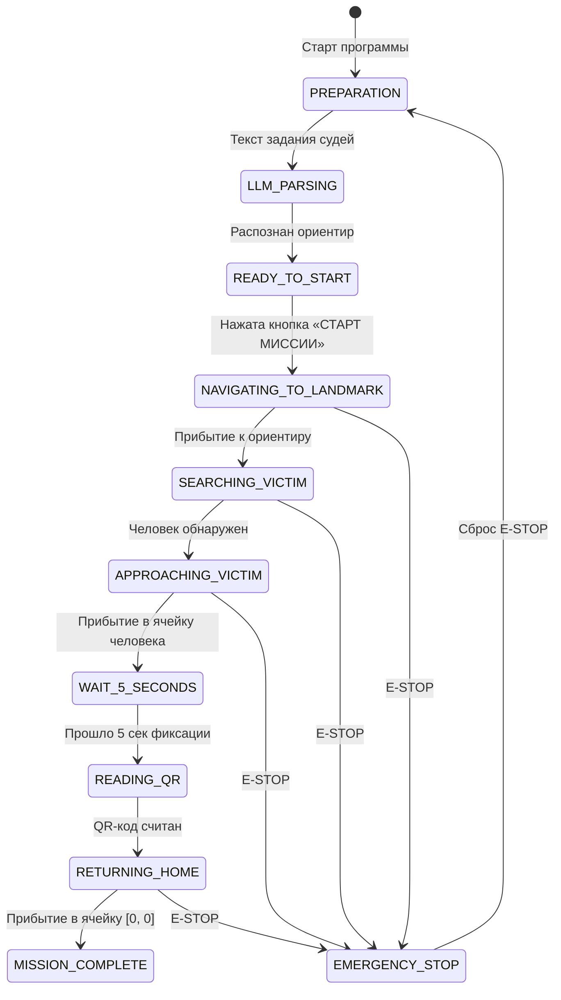

# Этап 5: Конечный автомат миссии и Web Dashboard (Ноутбук) — Отчет о реализации

Документ фиксирует результаты выполнения **Этапа 5** из [PLAN.md](PLAN.md) для автономного мобильного робота **IJKbot** (Хакатон «Эвакуация», «Кубок РТК Высшая Лига», Ижевск).

---

Актуализация 20.09.2026: этот отчёт описывает прототип и mock-испытания.
QR вынесен в `ijkbot_vision`, фиктивный поиск человека и фиктивное чтение QR
отключены в реальном режиме. Подтверждение реального NavigateToPose, отмена
навигации, преобразование odom→map и согласование ориентиров с картой остаются
незавершёнными. Сохранение протокола: `IJKBOT_LOG_DIR` либо `./log`.

## 1. Обзор выполненных задач

В рамках этапа реализован центральный диспетчер миссии — конечный автомат состояний **Mission State Machine** и интерактивный судейский веб-интерфейс **Web Dashboard** на базе **NiceGUI**.

Согласно требованиям регламента и судейской демонстрации:
1. **Мы ничего не решаем за судей**: в интерфейсе убраны искусственные счетчики баллов и таймеры. Система беспристрастно предоставляет полную прозрачность действий робота и результаты детекций.
2. **LLM подсистема** (Qwen 2.5 7B через Ollama) — автономная семантическая интерпретация текста судейского задания на русском языке в структурированную команду с обоснованием.
3. **Навигационный стек** (Nav2 / одометрия) — движение к ориентирам полигона и последующая эвакуация в стартовую ячейку `[0, 0]`.
4. **Компьютерное зрение** — обнаружение пострадавшего человека (манекена).
5. **Регламентное удержание** — позиционирование робота в ячейке пострадавшего не менее 5 секунд.
6. **QR-сканер** — принимает подтверждённый текст от отдельной ноды `ijkbot_vision/qr_reader_node` через `/victim_status`.
7. **Протокол и хронология событий** — непрерывный миллисекундный аудит всех действий робота с возможностью скачивания JSON-файла и автоматическим сохранением на диск при завершении миссии.
8. **Энергоэффективность и стабильность сети**: на ноутбук передаётся только сжатый JPEG-поток; сырые изображения и PointCloud2 по Wi-Fi не передаются.

---

## 2. Разработанные компоненты пакета `ijkbot_brain`

| Файл | Назначение |
|------|------------|
| [`ijkbot_brain/mission_sm.py`](ijkbot_brain/mission_sm.py) | Главный модуль конечного автомата `MissionStateMachine`, ROS 2 узел `MissionROSNode` и NiceGUI интерфейс. |
| [`ijkbot_brain/dashboard_app.py`](ijkbot_brain/dashboard_app.py) | Точка запуска Web Dashboard (консольный скрипт ROS 2 `dashboard_app`). |
| [`ijkbot_brain/test_mission_sm.py`](ijkbot_brain/test_mission_sm.py) | Модульные и интеграционные тесты автомата, таймеров и формирования протокола. |
| [`ijkbot_brain/package.xml`](ijkbot_brain/package.xml) | Манифест зависимостей (`rclpy`, `std_msgs`, `geometry_msgs`, `nav_msgs`). |
| [`ijkbot_brain/setup.py`](ijkbot_brain/setup.py) | Конфигурация точек входа консоли (`llm_client`, `mission_sm`, `dashboard_app`). |

---

## 3. Архитектура состояний (Mission State Machine)

Конечный автомат строго следует регламенту миссии:



---

## 4. Судейский веб-интерфейс (NiceGUI Web Dashboard)

Интерфейс оптимизирован для удобной демонстрации судьям соревнований:

1. **Шапка**:
   - Название: «IJKbot • Судейский Центр Управления Миссией».
   - Бейдж текущего состояния автомата со световой индикацией.
   - Переключатель «Режим симуляции (Mock) / Реальное железо».
2. **Панель ввода задания и управления**:
   - Свободное поле ввода текста задания на русском языке с кнопкой быстрой очистки.
   - Пример типового задания по умолчанию:
     > *«Пострадавший не может выбраться из автомобильного затора, образовавшегося на мосту. Необходимо найти его среди автомобилей»*
   - Двухшаговый запуск:
     1. Кнопка **«Распознать (LLM)»** — инференс Qwen 2.5 7B, определение ориентира и обоснования.
     2. Кнопка **«СТАРТ МИССИИ»** — запуск автономного движения робота.
   - Кнопки **«Пауза»**, **«Сброс»** и аварийный останов **«E-STOP»**.
3. **Интерактивная векторная SVG-карта арены 5×5 (4.0×4.0 м)** *(слева)*:
   - 25 квадратных ячеек $800 \times 800$ мм.
   - Стартовая ячейка `[0, 0]` («Пункт сбора»).
   - Разметка всех 7 ориентиров с подсветкой целевого объекта.
   - Фактическое положение робота, стрелка ориентации (Yaw), линия к текущей цели и траектория движения.
   - Числовые координаты: $X$, $Y$ (в метрах) и $Yaw$ (в градусах).
4. **Информационные карточки** *(справа)*:
   - **Результат анализа LLM**: целевой ориентир, рекомендованная тактика поиска, время инференса и текстовое обоснование с цитатами.
   - **Данные QR-кода пострадавшего**: статус считывания и полный медицинский протокол (ФИО, тяжесть, пульс, SpO2, диагноз).
5. **Протокол и хронология событий** *(внизу во всю ширину)*:
   - Хронологическая лента с миллисекундными метками `[ЧЧ:ММ:СС.мс]`.
   - Цветовая дифференциация категорий: `[LLM]`, `[NAV]`, `[VISION]`, `[QR]`, `[STATE]`, `[SYS]`, `[EMERGENCY]`.
   - Кнопка **«Скачать протокол (JSON)»** для судейской коллегии.
   - **Автоматическое сохранение на диск** в директорию `log/protocol_<timestamp>.json` при завершении миссии.

---

## 5. Интеграция с ROS 2 Jazzy

Узел `MissionROSNode` взаимодействует со следующими топиками:

| Топик ROS 2 | Тип сообщения | Описание |
|-------------|---------------|----------|
| `/cmd_vel` | `geometry_msgs/msg/Twist` | Управление линейной и угловой скоростью робота |
| `/goal_pose` | `geometry_msgs/msg/PoseStamped` | Отправка целевых путевых точек в стек Nav2 |
| `/odom` | `nav_msgs/msg/Odometry` | Прием одометрии и ориентации робота |
| `/victim_status` | `std_msgs/msg/String` | Прием считанной строки QR-кода |
| `/victim_detected` | `std_msgs/msg/Bool` | Прием флага детекции человека |
| `/mission/judge_task` | `std_msgs/msg/String` | Дистанционный ввод судейского задания |
| `/emergency_stop` | `std_msgs/msg/Bool` | Сигнал аппаратного/программного E-STOP |
| `/mission/state` | `std_msgs/msg/String` | Публикация текущего состояния автомата |

QR-декодирование намеренно вынесено из этого пакета: `ijkbot_vision/qr_reader_node`
подписывается на сжатое изображение и публикует подтверждённый текст в
`/victim_status`. В реальном режиме автомат не подменяет отсутствие QR фиктивными данными.

---

## 6. Результаты тестирования

Запуск тестов:
```bash
python3 -m unittest ijkbot_brain/test_mission_sm.py
```
Результат:
```text
.......
----------------------------------------------------------------------
Ran 7 tests in 0.152s

OK
```
Все 7 тестов пройдены успешно:
1. Инициализация в состоянии `PREPARATION`.
2. Анализ задания LLM и назначение путевой точки.
3. Распознавание судейского примера с автомобильным затором (`car_jam`).
4. Аварийная остановка E-STOP и возобновление.
5. Режим паузы и продолжения движения.
6. Сквозной цикл миссии через все регламентные состояния с соблюдением 5-секундного удержания.
7. Формирование «Протокола и хронологии событий», экспорт в JSON и сохранение на диск.

Сборка пакета ROS 2 выполнена успешно:
```bash
colcon build --symlink-install --packages-select ijkbot_brain
```

---

## 7. Инструкция по запуску

### Запуск интерфейса (NiceGUI):
```bash
ros2 run ijkbot_brain dashboard_app --port 8080
```
Открыть в браузере: `http://localhost:8080` (или `http://192.168.1.20:8080`).

### Боевой запуск на полигоне:
```bash
ros2 run ijkbot_brain mission_sm --no-mock --port 8080
```
